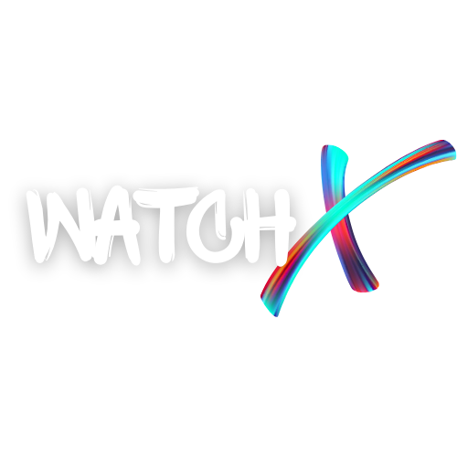

<div style="text-align:center;">
    
</div>

<p>
A web-app which can be used to get recommendations for a series/movie, the app recommends a list of media according to list of entered choices of movies/series in your preferred language using <strong>Python</strong> and <strong>Flask</strong> for backend and <strong>HTML</strong>, <strong>CSS</strong> and <strong>JavaScript</strong> for frontend.
</p>

 # This web-app contains 3 main pages:
- [This web-app contains 3 main pages:](#this-web-app-contains-3-main-pages)
  - [Home Page](#home-page)
  - [Recommendation Page](#recommendation-page)
  - [Movie Detail Page](#movie-detail-page)
  - [Netflix Page](#netflix-page)
- [How To Use](#how-to-use)
- [Team](#team)
- [Show Your Support](#show-your-support)

## Home Page
Here the user can choose list of their favourite movies and series and their preferred language. For example, I have entered a list with 2 Horror Movies(Insidious and Insidious Chapter 2), an action series(Supergirl) and a drama series(Suits) as my list of choices and English and Hindi as my preferred languages.
Clicking on the Get Started button the user will see the list of recommendations.


## Recommendation Page
Here the user will get poster images of all the recommended movies and series sorted based upon their IMDb Scores.


Clicking on any poster image, the user will be sent to the Movie Details page for the corresponding title.

## Movie Detail Page
Here are the complete details of the user selected title like Genre, Movie Summary, Languages in which movie is available, IMDb scores, Directors, Writers and Actors and so on. User will also find a link at the end of the page for the NEtflix Page of the corresponding title. 


## Netflix Page
This page is not a part of my web-app but an example what the user will see as the Netflix Page if they choose to click on the Netflix Link for the title.
You can login into your Netflix account and enjoy watching your selected movie or series from our recommendations.


# How To Use

To be able to use this web app locally in a development environment you will need the following:

1) You will need [Git](https://git-scm.com) installed on your computer.

2) Then From your terminal, you should do the following:

```bash
# Clone this repository
git clone https://github.com/TheChirag356/WatchX-Movie-and-Series-Recommendation.git

# Go into the repository
cd WatchX-Movie-and-Series-Recommendation

# Start the virtual environment - Windows
.\venv\Scripts\activate

# Install flask (if you already haven't)
pip install -r requirements.txt

```
3) To run this application you don't need to have any special configuration but make sure you don't change the directory of the project otherwise you can recieve errors while you try to run the app.

4) You can run the Flask App using the following command from your terminal:

``` bash
# Run the app
cd app
flask run
```

# Team
Anushka([@anushka](https://github.com/anushka-mazumdar))

Chirag Arora([@chiragarora](https://github.com/TheChirag356)) 

Himanshi Gupta([@himanshigupta](https://github.com/Himanshigupta1624))

Krishan Mittal([@krishanmittal](https://github.com/Krishan098))


# Show Your Support 

Give a ⭐️ if you like this project!